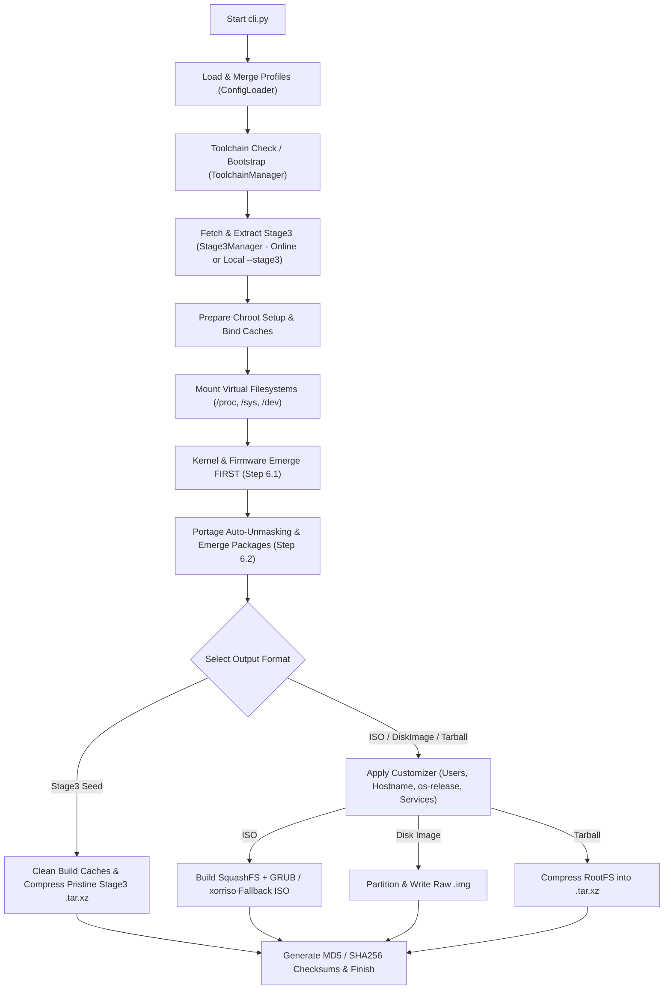

# Architecture & System Design

This page details the internal structure and design principles of **Gentoo Modern ISO & System Builder**.

---

## 🏗️ Directory Structure

```text
gentoo-builder/
├── cli.py                    # CLI entrypoint with flexible argument parser
├── core/
│   ├── config_loader.py      # Combines, merges, and validates JSON configurations
│   ├── stage3_manager.py     # Dynamically resolves and downloads Gentoo Stage3
│   ├── chroot_setup.py       # Handles resolv.conf and make.profile setups
│   ├── chroot_manager.py     # Mounts/unmounts proc, sys, dev and bind-caches
│   ├── portage_manager.py    # Manages make.conf, overlays, USE flags, and emerge
│   ├── customizer.py         # Configures livecd settings, users, os-release, branding
│   ├── iso_engine.py         # Builds final bootable SquashFS ISO or RootFS Tarball
│   ├── disk_engine.py        # Generates raw partitioned disk images
│   ├── toolchain_manager.py  # Manages the isolated toolchain environment
│   └── logger_setup.py       # System logging setup
├── configs/
│   ├── architectures/        # Architecture profiles (x86_64, arm64, riscv64...)
│   ├── base_customizations.json # Base copy entries (Plymouth, GRUB, os-release...)
│   ├── bootloaders/          # Bootloader configs (grub-uefi, syslinux...)
│   ├── custom_files/         # Custom artwork, Calamares, Plymouth, DM configs
│   ├── desktops/             # Desktop environment profiles (XFCE, GNOME, KDE...)
│   ├── inits/                # Init system profiles (openrc, systemd, runit, s6)
│   ├── kernels/              # Kernel configs (gentoo-kernel-bin, gentoo-sources...)
│   ├── packages/             # Categorized software package lists
│   └── services/             # Service activation profiles
└── tests/                    # Pytest test suite
```

---

## 🔄 Compilation Pipeline Flow

The orchestrator executes the build pipeline using the following sequential steps:



---

## 🔑 Key Architectural Principles

1. **Multi-Init Compatibility**:
   To ensure full compatibility across OpenRC, Systemd, Runit, and S6, `/etc/machine-id` is created as a real text file in the chroot, while `/var/lib/dbus/machine-id` is set as a symlink pointing to `/etc/machine-id`.
2. **Prioritized Kernel Installation**:
   Kernel packages (`sys-kernel/gentoo-kernel-bin`) are emerged **FIRST** before driver and desktop packages, guaranteeing `/usr/src/linux` and kernel symbols exist for out-of-tree hardware modules (`xf86-video-*`, `evdev`, `synaptics`).
3. **Pristine Stage3 Seed Building**:
   `--format stage3` creates pre-compiled rootfs seeds (`gentoo-modern-stage3-openrc-xfce-x86_64.tar.xz`). It cleans Portage temporary build files (`/var/tmp/portage/*`, `/tmp/*`) and skips live user/desktop customization, keeping the seed pristine for instant (< 2 min) downstream ISO builds via `--stage3`.
4. **Calamares Offline Installation**:
   Calamares extracts the pre-built, customized SquashFS image (`/live/filesystem.squashfs`) directly to the destination drive during installation, avoiding online Stage3 downloads and accelerating installation times.
5. **Portage Auto-Unmasking & Caching**:
   `emerge` commands pass `--autounmask-write=y --autounmask-continue=y` to handle ebuild USE flag dependencies automatically. Package tarballs are saved in `workdir/<arch>/cache` to make subsequent builds fast and incremental.
